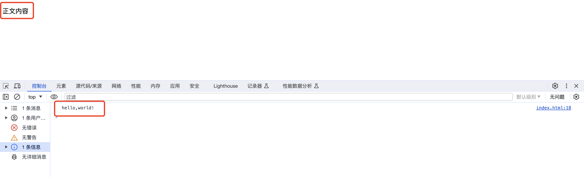

# zero.str
> Handling zero width characters in JavaScript.

利用零宽字符的不可见特性，可以在 web 页面中插入一些加密信息。

### 安装
```shell
npm i zero.str
```

### 使用
```jsx
import { encodeZeroWidth, decodeZeroWidth } from "zero.str"

// 插入零宽字符
const encodeStr = encodeZeroWidth("正文内容", "hello,world!")

// 获取零宽字符
const zeroWidth = decodeZeroWidth(encodeStr)
// zeroWidth = hello,world
```
### 页面效果
